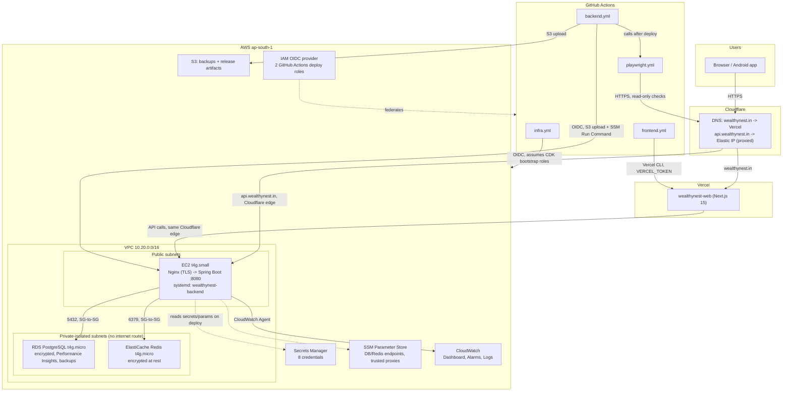

# WealthyNest — Production Architecture

## Overview

## Components

| Component | What it is | Why |
|---|---|---|
| **Vercel** | Hosts `wealthynest-web` | Already in place before this infra work; zero-config Next.js hosting, its own CDN/edge. |
| **Cloudflare** | DNS + edge proxy for `api.wealthynest.in` | Already the DNS provider. Proxied (orange-cloud) mode terminates the public TLS handshake, hides the EC2 IP, and gives free WAF/DDoS protection in front of the origin. |
| **EC2 (t4g.small, Ubuntu 26.04 LTS)** | Runs `wealthynest-api` as a systemd service behind Nginx | Public subnet with an Elastic IP; security group accepts 80/443 from Cloudflare's published ranges only — never `0.0.0.0/0`, never SSH (access is via SSM Session Manager). |
| **Nginx** | TLS termination (Cloudflare Origin CA cert) + reverse proxy to `127.0.0.1:8080` | Full (strict) mode with Cloudflare — the edge-to-origin hop is real TLS, not just Cloudflare-to-Flexible-HTTP. |
| **RDS PostgreSQL (t4g.micro)** | System of record | Private-isolated subnet, no route to the internet at all — not just security-group-restricted, actually unreachable from outside the VPC. Encrypted (own CMK), automated backups, Performance Insights. |
| **ElastiCache Redis (t4g.micro)** | Cache + rate-limit counters | Same private-isolated subnet. Encrypted at rest; **not** encrypted in transit — see `deployment-guide.md`'s TLS note for why, and the follow-up it points to. |
| **Secrets Manager** | 8 credentials (DB, JWT, Vault keys, Google OAuth, SMTP, FCM) | See `secrets-management-guide.md` for the full list and which are auto-generated vs. need manual population. |
| **SSM Parameter Store** | Non-secret runtime config (DB URL, Redis host/port, Cloudflare trusted-proxy list) | Single-sourced from the same `cdk.json` values that drive the security group and Nginx, instead of a third hand-copied duplicate. |
| **S3 bucket** | Application backups + backend release artifacts (`backend-releases/<version>/`) | Versioned, SSE-KMS, lifecycle to Glacier then expiry, public access fully blocked. |
| **CloudWatch** | Dashboard + alarms (EC2 CPU/memory/disk, RDS CPU/storage/memory/connections, Redis CPU/evictions) + log groups (app, nginx, system) | SNS topic with an email subscription for every alarm. |
| **IAM OIDC + 2 roles** | GitHub Actions authenticates to AWS with zero long-lived keys | `BackendDeployRole` (S3 + SSM Run Command, scoped to one instance) and `InfraDeployRole` (can only assume the CDK bootstrap roles). Both trust exactly `repo:<owner>/wealthynest:ref:refs/heads/main`. |

## Request path (production)

1. Browser resolves `wealthynest.in` → Vercel; `api.wealthynest.in` → Cloudflare edge → EC2's Elastic IP.
2. Cloudflare terminates the client TLS connection, re-encrypts to the origin (Full strict), and forwards with `CF-Connecting-IP` set to the real client IP.
3. Nginx on the EC2 instance terminates that inbound TLS (Cloudflare Origin CA cert), sets `X-Real-IP`/`X-Forwarded-For` from `$remote_addr` (itself derived from `CF-Connecting-IP` via `set_real_ip_from`), and proxies to Spring Boot on `127.0.0.1:8080`.
4. Spring Boot's `RateLimitConfig` trusts exactly Cloudflare's ranges as the source of `CF-Connecting-IP`/`X-Forwarded-For` — the same range list that drives the security group and Nginx's `set_real_ip_from`.
5. The app connects to RDS/ElastiCache over the VPC's internal network — those two never see traffic that didn't originate from the app server's own security group.
